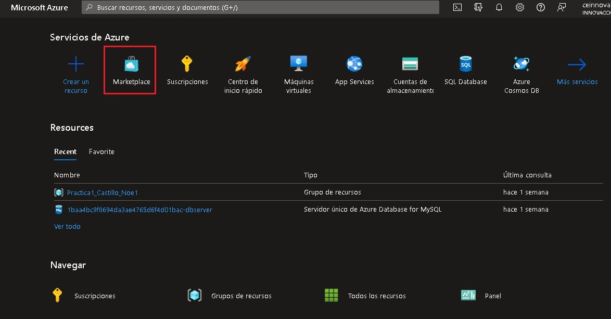
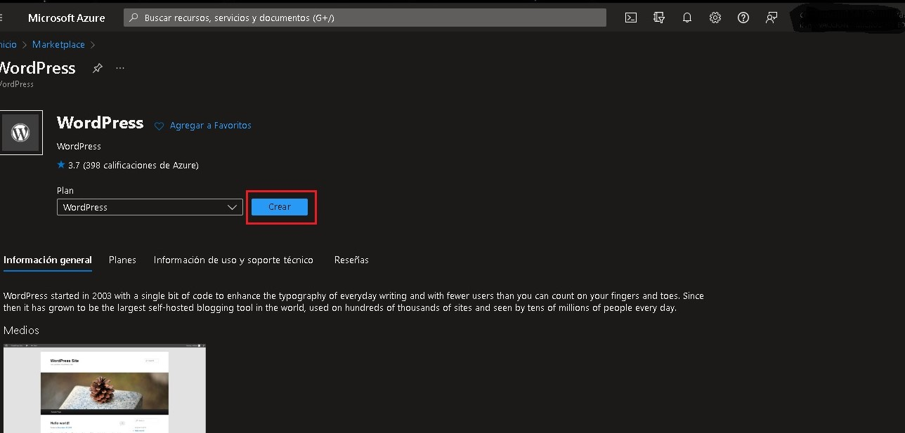
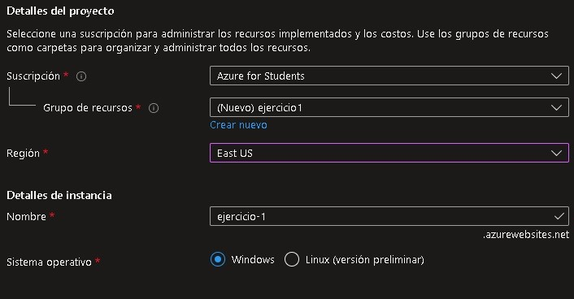
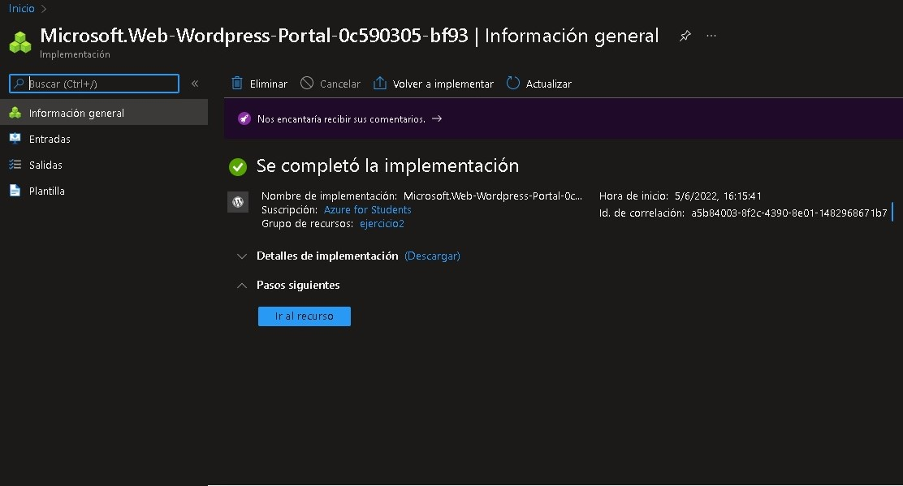
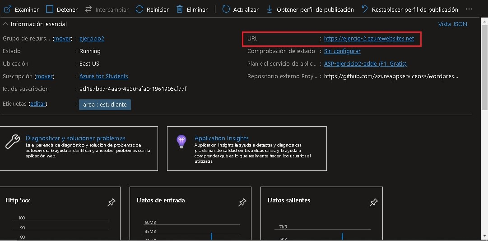
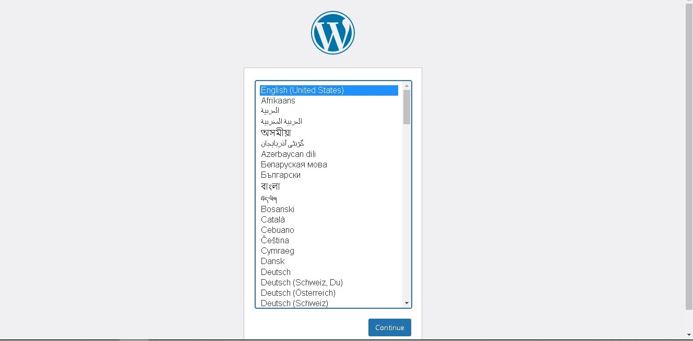

# Creación de Wordpress en App Service de Azure
Elaboración de una página en Wordpress con las herramientas que Azure nos proporciona. Esto para conocer y comprender mejor la plataforma y el uso de **Azure**.

**Requisitos**
- Tener una Cuenta en Microsoft [Azure](https://portal.azure.com/).

En caso de no contar con una, podemos [crear una cuenta](https://azure.microsoft.com/es-mx/free/search/?&ef_id=CjwKCAjwtIaVBhBkEiwAsr7-cxSWWjaWPUN16ph7R6-NDsphguw5CeHInNawI02F12gw-5IAOUvOWBoCIUgQAvD_BwE:G:s&OCID=AID2200215_SEM_CjwKCAjwtIaVBhBkEiwAsr7-cxSWWjaWPUN16ph7R6-NDsphguw5CeHInNawI02F12gw-5IAOUvOWBoCIUgQAvD_BwE:G:s&gclid=CjwKCAjwtIaVBhBkEiwAsr7-cxSWWjaWPUN16ph7R6-NDsphguw5CeHInNawI02F12gw-5IAOUvOWBoCIUgQAvD_BwE) gratuita o de pago. 

--------------------------------------------

## Crea tu página

1. Con la cuenta de Azure accedemos al [portal](https://portal.azure.com/) y en el buscador escribimos la palabra **Marketplace** o podemos seleccionarlo directamente en los servicios de Azure.

2. Una vez seleccionado buscamos **WordPress** y accedemos para crear.

3. Una vez adentro tenemos que completar los campos solicitados:

- **Suscripción**: Seleccionamos la suscripción con la que nos asociamos a Azure.
- **Grupo de Recursos**: Crearemos uno nuevo y le asignamos un nombre de identificación.
- **Región**: Es el servidor al cual nos conectaremos dependiendo nuestra ubicación geográfica se selecciona el más cercano a nosotros para tener menor latencia.
- **Detalle de Instancia**: Le asignamos un nombre y dejamos por default nuestro sistema operativo (Windows).

4. Posteriormente nos vamos a la pestaña de etiquetas y asginamos un nombre y un valor. Las etiquetas nos sirven para sacar reportes de costos y cumplir las normativas de seguridad.

5. Le damos en la opción **revisar y crear** y verificamos que todos nuestros datos estén correctos.

6. Le damos en **Crear** y nos despues de unos momentos nos deberá aparecer algo parecido a lo siguiente:

7. Damos click en *Ir al recurso* y nos dirigimos a la URL proporcionada.

8. Se nos abrirá nuestra **Página en WordPress** creada con **Azure**.

----------------------
Con esto, daremos por concluida nuestra práctica en la creación de una página en WordPress con Microsoft Azure.